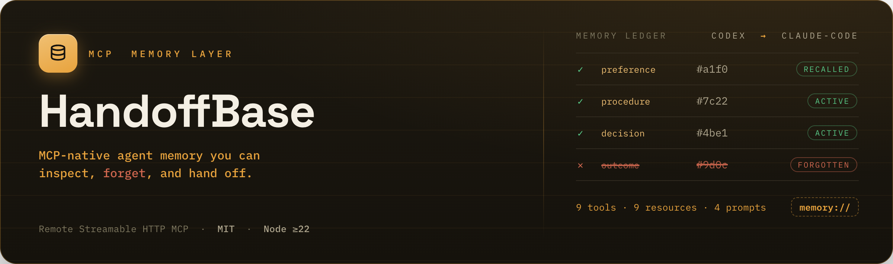
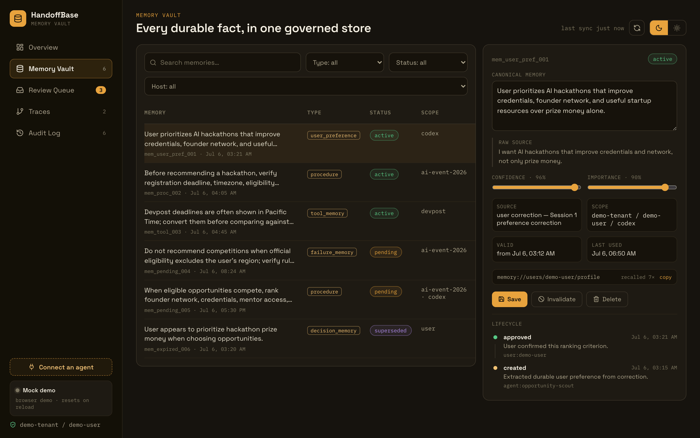
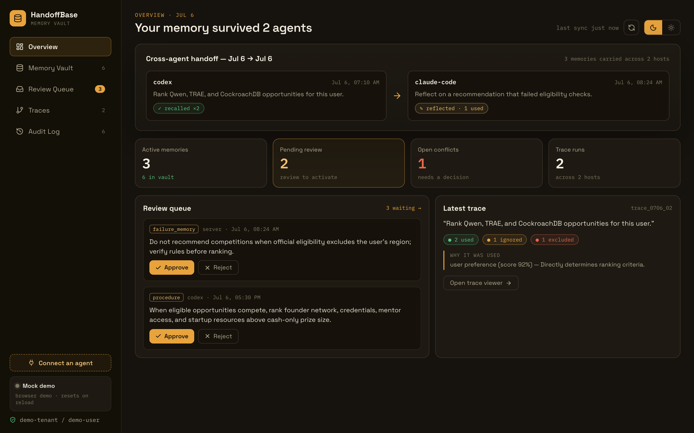
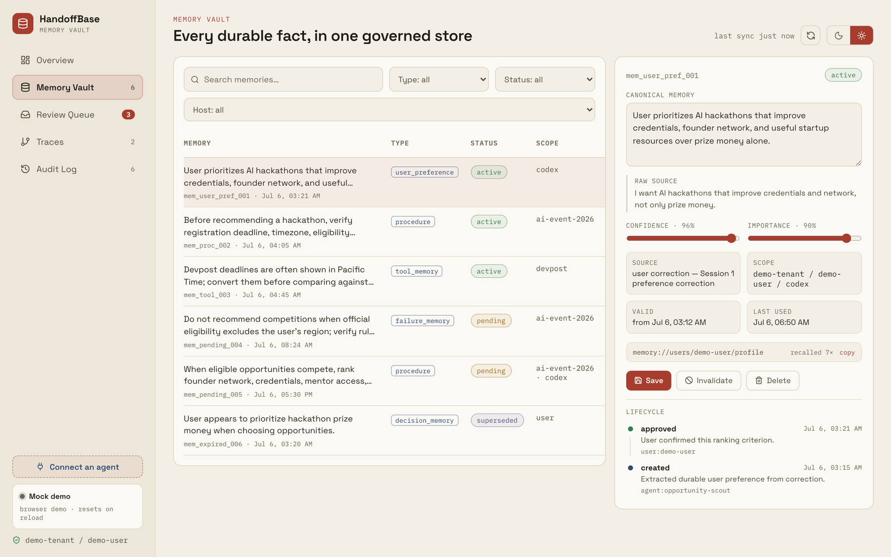
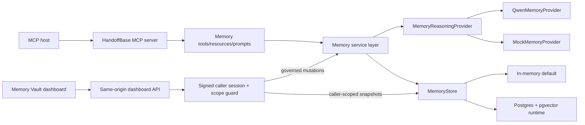

<!--
Top block images are committed under ./docs/assets/ :
  hero.png  ·  dashboard-memory-vault.png  ·  dashboard-overview.png  ·  dashboard-memory-vault-light.png
The dashboard shots are REAL captures of the shipped v2 Memory Vault (mock fixture),
not mockups. Regenerate them from HEAD before submission if the UI changes.
-->
<div align="center">



# HandoffBase

**MCP-native agent memory you can inspect, forget, and hand off.**

[](https://github.com/jensonChow/handoffbase/actions/workflows/ci.yml)
[](./LICENSE)


[](./docs/benchmarks.md)

A Remote Streamable HTTP MCP server that preserves, recalls, budgets, and strategically forgets agent memory across sessions, hosts, and projects — with a Memory Vault governance dashboard and a byte-stable comparative benchmark ([17/17 vs 0/17 baseline](./docs/benchmarks.md), our own evaluator) to prove it.

<sub>Runnable infrastructure MVP · default in-memory store + mock provider · Postgres + Qwen are opt-in · built for the Alibaba Cloud / Qwen agentic-memory hackathon (Track 1)</sub>

<sub><a href="#quickstart"><b>Quickstart</b></a> · <a href="#what-is-implemented">What's implemented</a> · <a href="#mcp-tools">MCP surface</a> · <a href="#the-memory-vault-dashboard">Dashboard</a> · <a href="#eval-awareness">Benchmarks</a> · <a href="#architecture">Architecture</a></sub>



</div>

## Why HandoffBase

Modern AI agents are useful, but continuity is fragmented:

- New sessions forget corrections, tool experience, and prior outcomes.
- Repository files such as `AGENTS.md` or `CLAUDE.md` help inside one project,
  but do not provide portable cross-host user memory.
- Codex, Claude Code, Cursor, and custom agents each have their own context
  surface.
- Users need a way to inspect, approve, update, forget, and trace the memories
  that influence agent behavior.

HandoffBase treats memory as shared infrastructure. Agents connect through MCP,
call explicit memory tools, read `memory://` resources, and return auditable
trace ids instead of silently stuffing old chat history into prompts.

## Core Idea

```text
Codex / Claude Code / Cursor / custom MCP host
        |
        | Remote Streamable HTTP MCP
        v
HandoffBase MCP server
        |
        +--> MemoryReasoningProvider
        |       +--> QwenMemoryProvider
        |       +--> MockMemoryProvider
        |
        +--> MemoryStore
        |       +--> In-memory default
        |       +--> Postgres + pgvector runtime
        |
        +--> Memory Vault same-origin server backend
```

Every connected agent can:

- bootstrap a new session with the right continuity context,
- recall relevant long-term memories for a task,
- remember new durable facts, procedures, preferences, and failures,
- reflect on completed runs,
- record helpful or unhelpful feedback and propose governed corrections,
- update, supersede, expire, or forget outdated memories,
- resolve governed conflicts with explicit lifecycle actions,
- explain which memories were used, ignored, or excluded.

## What Is Implemented

| Area | Current implementation |
| --- | --- |
| MCP transport | Remote Streamable HTTP server at `/mcp` |
| MCP surface | 9 tools, 9 `memory://` resources, and 4 reusable prompts |
| Memory core | `@handoffbase/memory-core` with records, scopes, lifecycle, events, traces, validation, and sensitive-data rejection |
| Providers | `MemoryReasoningProvider`, `QwenMemoryProvider`, and deterministic `MockMemoryProvider` |
| Store | Credential-free in-memory default; opt-in `PostgresMemoryStore` runtime selected by `STORE_MODE=postgres` after an explicit migration |
| Dashboard | Next.js Memory Vault with same-origin server APIs by default; it follows the MCP runtime's `STORE_MODE`/`DATABASE_URL`, while mock mode is explicit |
| Demo | Deterministic AI Opportunity Scout flow and JSON-RPC/HTTP example payloads |
| Product proof | Comparative 17-case memory benchmark, cleaned-format LongMemEval adapter with tiny fixture, and real HTTP/MCP cross-host E2E |
| Deployment proof | Live Alibaba Cloud International ECS + Docker deployment with HTTPS, API-key auth, Qwen reasoning/embeddings, and Postgres/pgvector |

## The Memory Vault Dashboard

HandoffBase ships a Next.js **Memory Vault** — a governance UI that makes the
memory lifecycle visible instead of hidden inside prompts. Inspect every durable
memory with its type, status, confidence, importance, scope, lifecycle, and
`memory://` address; approve or reject pending candidates; edit, supersede, or
forget stale ones; and open the trace that explains which memories an agent
used, ignored, or excluded.

The Overview opens on the handoff itself — memories written in one host
(`codex`) recalled in another (`claude-code`) — beside pending review, open
conflicts, and the latest recall trace with its used / ignored / excluded
breakdown:

<div align="center">
  
</div>

It ships in both the dark **Amber Archive** and light **Paper Ledger** themes;
here the vault list and record editor in Paper Ledger:

<div align="center">
  
</div>

Run the exact demo above locally against a deterministic in-browser fixture — no
MCP server, database, or credentials required:

```bash
HANDOFFBASE_DASHBOARD_CLIENT_MODE=mock npm run dashboard:dev
```

Then open <http://localhost:3001>. Without the mock flag the dashboard talks to
the same-origin server API and follows the MCP runtime's `STORE_MODE`.

## Quickstart

Requires Node.js 22 or newer.

```bash
npm ci
npm run check
npm run dev:server
```

`npm run dev:server` and `npm run start:server` automatically pass a root
`.env.local` file to Node when that file exists. If it does not exist, startup
uses the current shell or cloud environment normally. The launcher never prints
environment values.

The local MCP server listens at:

```text
http://127.0.0.1:3000/mcp
```

If port 3000 is already in use:

```bash
PORT=3333 npm run dev:server
```

Call a local tool with the included Opportunity Scout payload:

```bash
MCP_ENDPOINT=http://127.0.0.1:3000/mcp npm run mcp:call -- memory_recall examples/http/payloads/memory-recall-rank-opportunities.json
```

If you selected port `3333`, use that same port in `MCP_ENDPOINT`.

Useful commands:

```bash
npm run smoke
npm run test
npm run dashboard:dev
npm run demo:flow
npm run demo:jsonrpc
npm run eval:memory
npm run bench:memory
npm run bench:longmemeval:tiny
npm run e2e:cross-host
```

The dashboard uses `http://localhost:3001` by default, so it can run beside the
MCP server on port `3000`.

`npm run check` is the CI-parity command. It typechecks, builds the server and
workspaces, runs deterministic unit/integration gates, the MCP registration
smoke test, the local eval and comparative benchmark, the LongMemEval tiny
fixture, the real HTTP/MCP cross-host E2E, the Markdown relative-link check, and
the tracked-file secret scan. It must pass without Qwen credentials, a
database, Docker, or network access.

`npm run bench:memory` runs the deterministic local benchmark-inspired memory
fixture subset without Qwen credentials or network access. Its recorded
comparative result is HandoffBase 17/17 versus no-memory 0/17, with 34/34
expectation conformance. This is not an official benchmark score.

## Health And Dependency Readiness

- `GET /health` is a liveness and configured-mode check. It does not contact
  Postgres or Qwen.
- `GET /ready` is dependency readiness. Postgres mode runs a real schema query
  that verifies the connection and current migrated `memories` and
  `memory_feedback` tables; Qwen mode makes a live one-token provider probe.
  In-memory and mock modes complete their corresponding checks locally.
- The store check runs on every request. Qwen readiness performs one live token
  probe on the first request, then reuses that result for five minutes by
  default; concurrent cache misses share one in-flight request.

The live Qwen probe has a very small token cost. Use `/health` for frequent
liveness polling and `/ready` before sending traffic or recording deployment
proof. In `api_key` mode, `/ready` requires the same Bearer or HandoffBase key
header as `/mcp`. The default loopback-only local server may probe Qwen with
auth disabled so a local `.env.local` setup can verify itself. A non-loopback
Qwen runtime with auth disabled, including the explicit insecure demo override,
fails closed before a model call. Readiness responses contain status metadata,
not provider response text.

## Qwen Setup

Local development works without cloud credentials by using `MockMemoryProvider`.
To exercise the Qwen-backed path:

```bash
cp .env.example .env.local
```

Then set one of these credentials in your local or cloud environment:

- `QWEN_API_KEY`
- `DASHSCOPE_API_KEY`

Optional Qwen/DashScope settings:

- `QWEN_BASE_URL` or `DASHSCOPE_BASE_URL`
- `QWEN_MODEL` or `DASHSCOPE_MODEL`
- `QWEN_TIMEOUT_MS`

The root server launcher loads `.env.local` automatically when present. Values
already exported by the shell or supplied by a cloud runtime remain available,
so production deployment does not require a local env file.

Never commit `.env.*` files. Keep Qwen keys, DashScope keys, HandoffBase API
keys, dashboard session secrets, database URLs, cloud credentials, cookies, and
auth headers in local or cloud secret configuration only.

Qwen is used for the reasoning-heavy memory work:

- extracting durable memories from conversations, run summaries, and tool notes,
- classifying type, scope, importance, and validity,
- detecting conflicts with existing memory,
- building token-budgeted context packs,
- reflecting on completed agent runs,
- explaining memory usage traces.

The memory core remains provider-agnostic. Qwen-specific logic lives behind
`QwenMemoryProvider`; the default local/test path remains mock-provider
compatible.

## Postgres Runtime

No database is required for the default local or CI path. To use durable
storage, provide a Postgres database with the vector extension available,
apply the schema explicitly, and then select the runtime:

```bash
DATABASE_URL=<postgres-url> npm run db:migrate
STORE_MODE=postgres DATABASE_URL=<postgres-url> npm run dev:server
```

`STORE_MODE=postgres` fails fast if `DATABASE_URL` is missing. Migration is
never run implicitly at server startup. `POSTGRES_URL` is not a runtime alias;
use `DATABASE_URL`.

If Docker and the Compose plugin are available, the repository also provides a
disposable local persistence harness. It creates an isolated pgvector
container, applies the migration, writes a memory, restarts Postgres, recalls
the memory, and removes the container and volume:

```bash
npm run test:postgres:restart
```

This Docker-only harness is intentionally outside `npm run check` so the safe
CI path stays credential-free and database-free. Docker was unavailable in the
current integration environment, so this command has not been reported as
passed here.

## Connect Via MCP

HandoffBase is remote-first. MCP hosts should connect to the Streamable HTTP
endpoint exposed by the server:

```text
http://127.0.0.1:3000/mcp
```

For deployed environments, put HTTPS and API-key auth in front of the service
before using it with real data. Remote clients can authenticate with either a
bearer token or `X-Handoffbase-Api-Key`; keep the key value in the host's secret
configuration, not in tracked project files. An auth-disabled server may bind
loopback only; a non-loopback bind fails startup unless the isolated-demo
override is explicitly enabled.

API-key caller mappings are strict: unknown authorization fields or malformed
grant lists fail configuration. A missing `allowedProjectIds` or
`allowedAgentProfileIds` field means unrestricted within that dimension, while
an explicit empty list means deny-all.

The MCP server exposes tools for memory actions, resources for readable vault
views, and prompts for memory-aware workflows. Local stdio is intentionally not
the MVP path because the product value comes from one shared memory layer across
hosts and sessions.

For Codex, copy the canonical local or remote `config.toml` table from the
[MCP host examples](examples/mcp/README.md). The remote example reads its Bearer
token from `HANDOFFBASE_MCP_TOKEN`; it never stores the token in Codex config.

## Remote MCP Validation

The repo includes a remote validator. The default `generic` profile discovers
the deployed auth/provider/store modes instead of requiring one fixed
combination:

```bash
MCP_ENDPOINT=https://handoffbase.example.com/mcp \
MCP_AUTH_TOKEN=<temporary-handoffbase-access-token> \
npm run mcp:validate-remote
```

For a live Postgres deployment, use explicit assertions because the legacy
`alibaba-demo` profile expects the released in-memory proof:

```bash
EXPECTED_AUTH_MODE=api_key \
EXPECTED_PROVIDER_MODE=qwen \
EXPECTED_STORE_MODE=postgres \
EXPECTED_EMBEDDING_MODE=qwen \
MCP_ENDPOINT=https://<your-deployment-host>/mcp \
MCP_AUTH_TOKEN=<temporary-handoffbase-access-token> \
npm run mcp:validate-remote
```

Keep `MCP_AUTH_TOKEN` in the shell or secret manager. Do not paste token values
into tracked files or command logs.

The validator always checks:

- `GET /health` identifies HandoffBase over Streamable HTTP,
- `GET /ready` returns HTTP 200 for current dependency readiness,
- MCP `tools/list` exactly matches the current nine-tool manifest,
- `memory_recall` returns a trace id,
- `memory_remember` exercises the configured provider path.

Only for a legacy deployment that does not expose `/ready`, set
`MCP_SKIP_READINESS=1` explicitly. This skips only readiness; the current tool
manifest and MCP behavior checks still run.

The current Singapore deployment evidence is recorded in
[`docs/deployment/alibaba-cloud-proof.md`](docs/deployment/alibaba-cloud-proof.md).
It is a live HTTPS Alibaba Cloud ECS proof with Postgres persistence, not a
managed multi-zone SaaS service.

## MCP Tools

| Tool | Purpose |
| --- | --- |
| `continuity_bootstrap` | Build a compact continuity context pack for a new session. |
| `memory_recall` | Recall relevant memories for a task, query, and scope. |
| `memory_remember` | Create durable memory candidates from corrections, notes, or observations. |
| `memory_reflect` | Reflect on a completed agent run and propose durable memories. |
| `memory_update` | Edit, merge, or supersede an existing memory record. |
| `memory_forget` | Invalidate, archive, expire, or physically hard-delete an existing memory, or run an `enforce_capacity` strategic-forgetting sweep that archives the lowest-retention memories beyond a caller-declared capacity. |
| `memory_trace` | Explain which memories were used, ignored, or excluded. |
| `memory_feedback` | Record helpful or unhelpful feedback for a memory or trace and optionally propose a pending correction. |
| `memory_resolve_conflict` | Apply an authorized conflict decision and persist its lifecycle and audit effects. |

## MCP Resources

| Resource | Purpose |
| --- | --- |
| `memory://users/{user_id}/profile` | Readable continuity profile for a user. |
| `memory://agents/{agent_profile_id}/procedures` | Procedure memories scoped to an agent profile. |
| `memory://agents/{agent_profile_id}/failures` | Failure memories scoped to an agent profile. |
| `memory://projects/{project_id}/facts` | Project fact memories. |
| `memory://projects/{project_id}/tool-notes` | Tool memories scoped to a project. |
| `memory://runs/{run_id}/summary` | Summary for a remembered agent run. |
| `memory://traces/{trace_id}` | Trace detail for memory selection and exclusion. |
| `memory://vault/pending` | Pending memory candidates awaiting review. |
| `memory://vault/conflicts` | Memory conflicts awaiting resolution. |

## MCP Prompts

| Prompt | Purpose |
| --- | --- |
| `memory-aware-start` | Start a session by bootstrapping continuity context before acting. |
| `post-run-reflection` | Review a completed run and identify durable memories. |
| `memory-review` | Guide pending memory review decisions. |
| `conflict-resolution` | Resolve conflicts between existing and proposed memories. |

## Memory Lifecycle

| Stage | What happens |
| --- | --- |
| Remember | `memory_remember` extracts candidate memories from explicit notes, corrections, or observations. |
| Review | Candidates can remain `pending` for user or dashboard review before activation. |
| Recall | `memory_recall` retrieves scoped, valid memories and returns a trace id. |
| Bootstrap | `continuity_bootstrap` builds a token-budgeted context pack for a new host/session. The budget is enforced server-side on the rendered context lines — `estimated_tokens <= token_budget` holds by construction (heuristic chars/4 estimator, not an official tokenizer), trimmed memories are recorded on the trace, and a provider echoing a bogus budget cannot bypass it. |
| Reflect | `memory_reflect` turns run outcomes into procedure, decision, tool, failure, or outcome memories. |
| Trace | `memory_trace` and `memory://traces/{trace_id}` explain selected, ignored, and excluded memories. |
| Feedback | `memory_feedback` records user judgment and can create a pending correction memory for review. |
| Resolve | `memory_resolve_conflict` accepts or rejects a candidate, supersedes an existing memory, merges, keeps both, or dismisses the conflict. |
| Update | `memory_update` edits, merges, or supersedes stale or conflicting memories. |
| Forget | `memory_forget` invalidates, archives, expires, or physically hard-deletes memory records while keeping a content-redacted audit tombstone. Its `enforce_capacity` mode is governed strategic forgetting: a dry-run-first sweep that archives (never deletes) the lowest-retention active memories beyond a declared capacity, emits one audit event per eviction, and writes a `capacity_sweep` trace explaining every decision. The retention score is the non-query projection of the recall ranking, so what recall would rank last is what capacity pressure evicts first. A sweep only evicts memories at least as narrow as its own scope — a project-scoped sweep never archives user-wide memories other projects still recall — and dry-run and apply use identical eligibility. |

Memory types currently modeled:

```text
identity
user_preference
procedure
project_fact
tool_memory
decision_memory
failure_memory
outcome_memory
negative_preference
skill
```

## Inspection And Governance

HandoffBase is designed so users and operators can see how memory affects
answers:

- `memory_trace` explains which memories were used, ignored, or excluded.
- `memory://traces/{trace_id}` exposes trace details through MCP resources.
- `memory://vault/pending` exposes pending memory candidates.
- `memory://vault/conflicts` exposes open conflict records.
- The Memory Vault dashboard shows vault, pending review, trace, and
  conflict-review views through same-origin server API routes by default.
- Its default `server_in_memory` backend belongs to the separate Next.js process;
  it is seeded for the dashboard demo and does not expose the MCP server's
  process-local in-memory store.
- With `HANDOFFBASE_AUTH_MODE=api_key`, dashboard sign-in exchanges a
  HandoffBase API key for a signed, same-origin HttpOnly session cookie. Set the
  server-only `HANDOFFBASE_DASHBOARD_SESSION_SECRET` to a random value of at
  least 32 characters; never expose it through `NEXT_PUBLIC_*` or commit it.
  Production Dashboard requests fail closed when auth is disabled, and
  production mutations require a matching same-origin `Origin` header.
- In `STORE_MODE=postgres`, its server backend uses the same `DATABASE_URL` as
  the MCP runtime. The signed dashboard session derives tenant/user identity
  from the authenticated HandoffBase API-key mapping; optional server-only
  `HANDOFFBASE_DASHBOARD_*` values can narrow, but never replace, that caller
  grant. `HANDOFFBASE_DASHBOARD_CLIENT_MODE=mock` selects fixture-only mock mode.

This is not only retrieval. The memory lifecycle is meant to be governed:
pending approval, conflict review, supersession, expiry, deletion, and trace
inspection are first-class behaviors.

### Turn feedback into a runnable regression

For unhelpful feedback with a correction, `memory_feedback` and the Dashboard
produce a sanitized regression fixture. Copy that JSON to a local file, convert
it into the existing long-memory benchmark schema, then run only that fixture:

```bash
npm run feedback:to-benchmark -- \
  /tmp/handoffbase-feedback-fixture.json \
  --public-safe-confirmed \
  --output /tmp/handoffbase-feedback-benchmark.json

npm run bench:memory -- \
  --fixture /tmp/handoffbase-feedback-benchmark.json
```

The converter rejects helpful-only records, missing corrections, unknown
identity/scope fields, UUIDs, and detected secret material. It emits a
deterministic synthetic scope and never edits the tracked benchmark suite. The
explicit `--public-safe-confirmed` flag records that a human reviewed the draft
for names or other contextual identifiers that automated checks cannot reliably
detect. The `--output` path must not already exist.

## Architecture



More detail:

- [Architecture](docs/architecture.md)
- [Architecture diagram](docs/assets/architecture.mmd)
- [Memory lifecycle](docs/memory-lifecycle.md)
- [Technical design](docs/technical-design.md)
- [Comparison](docs/comparison.md)
- [Effect claims](docs/effect.md)
- [Eval pack](docs/evals.md)
- [Benchmark strategy](docs/benchmarks.md)
- [Recorded local benchmark results](docs/benchmark-results.md)
- [LongMemEval adapter](benchmarks/longmemeval/README.md)
- [Cross-host E2E proof](docs/workstreams/cross-host-e2e.md)
- [Product completeness](docs/product-completeness.md)
- [Product workflows](docs/product-workflows.md)
- [Dashboard demo](docs/demo-dashboard.md)
- [Deployment notes](docs/deployment.md)
- [Alibaba Cloud deployment proof](docs/deployment/alibaba-cloud-proof.md)
- [Alibaba ECS relaunch runbook](docs/deployment/relaunch-runbook.md)
- [Development and public-readiness checklist](docs/dev-materials-checklist.md)
- [Devpost submission copy](docs/submission/devpost-copy.md)
- [Devpost architecture notes](docs/submission/architecture-for-devpost.md)
- [Submission testing instructions](docs/submission/testing-instructions.md)
- [Submission checklist](docs/submission/submission-checklist.md)
- [Video recording shot list](docs/submission/recording-shot-list.md)
- [Final public-readiness checklist](docs/submission/final-public-readiness.md)

## Examples And Demo

- [Examples overview](examples/README.md)
- [MCP host config examples](examples/mcp/README.md)
- [HTTP examples](examples/http/README.md)
- [Quickstart: remember preference](examples/quickstart/remember-preference.md)
- [Quickstart: recall memory](examples/quickstart/recall-memory.md)
- [Quickstart: trace memory](examples/quickstart/trace-memory.md)
- [Quickstart: bootstrap session](examples/quickstart/bootstrap-session.md)
- [Memory eval fixture](examples/evals/opportunity-scout-memory-eval.json)
- [AI Opportunity Scout demo flow](demo/opportunity-scout/demo-flow.md)
- [HTTP JSON-RPC examples](examples/http/opportunity-scout.http)
- `examples/http/payloads/*` for direct MCP tool payloads
- `npm run demo:flow` for an offline narration
- `npm run demo:jsonrpc` for JSON-RPC request examples
- `npm run eval:memory` for the deterministic local memory eval pack
- `npm run bench:memory` for the 17-case comparative local benchmark
- `npm run bench:longmemeval:tiny` for the synthetic three-backend adapter gate
- `npm run e2e:cross-host` for real Express/HTTP/MCP cross-host continuity
- `npm run demo:cross-host` for the human-readable version of that scenario
- `npm run dashboard:dev` for the local Memory Vault dashboard prototype

The demo shows a user teaching an opportunity-scouting agent their hackathon
preferences, a later session recalling those preferences, a failure reflection
creating a future guardrail, and another host receiving the same scoped memory
through MCP.

## Comparison

HandoffBase is not positioned as universally better than existing memory
systems. The current goal is narrower: MCP-native, traceable, governed memory
handoff across agents and hosts.

See [docs/comparison.md](docs/comparison.md) for the longer positioning note.

| Project | Strong fit | HandoffBase difference |
| --- | --- | --- |
| [Mem0](https://docs.mem0.ai/introduction) | Universal memory layer, hosted/open-source memory, agent plugins, framework integrations. | HandoffBase is Remote MCP first: tools, resources, prompts, trace ids, and user-governed memory vault resources are the product surface. |
| [Zep](https://help.getzep.com/overview) | Enterprise-scale agent memory with temporal graph/context infrastructure. | HandoffBase is a lighter MCP-native handoff layer; the current MVP does not claim graph-scale enterprise retrieval. |
| [Letta](https://docs.letta.com/) | Memory-first agent runtime with agents, tools, blocks, channels, and app/server surfaces. | HandoffBase does not require migrating to a new agent runtime; it sits beside existing MCP hosts. |
| [LangMem](https://langchain-ai.github.io/langmem/) | LangGraph/LangChain-oriented memory primitives, background managers, and memory tools. | HandoffBase is host-agnostic infrastructure exposed as a Remote Streamable HTTP MCP service. |

## Eval Awareness

The repo includes deterministic product-proof checks rather than an official
leaderboard claim:

- MCP registration smoke test,
- memory-core lifecycle, validation, sanitizer, and Postgres contract tests,
- auth and server route tests,
- dashboard API tests,
- a local eval pack at [docs/evals.md](docs/evals.md),
- a comparative synthetic benchmark with recorded HandoffBase 17/17 versus
  no-memory 0/17 and 34/34 expectation conformance,
- a real loopback HTTP/MCP cross-host scenario, and
- a cleaned-format LongMemEval adapter with a synthetic tiny fixture, explicit
  deterministic/Qwen modes, and official-evaluator-compatible hypotheses.

The official LongMemEval dataset was not downloaded or vendored, the full
credentialed run has not been completed, no paid judge was invoked, and no
official LongMemEval score exists. See
[the LongMemEval adapter guide](benchmarks/longmemeval/README.md) for the exact
manual boundary.

## Current Limitations

- The live Alibaba Cloud proof uses `storeMode=postgres` and
  `embeddingMode=qwen`; the credential-free local default remains in-memory.
- Postgres and Caddy TLS state run on one ECS host rather than managed
  multi-zone services. A verified logical backup was copied off ECS, but there
  is no managed backup service.
- The public ECS proof uses a free `sslip.io` HTTPS hostname; production use
  should add a custom domain, stronger monitoring, and managed high availability.
- The Memory Vault dashboard has a real server-backed path, but it is not a
  hardened production admin console.
- The comparative benchmark and LongMemEval tiny fixture are deterministic and
  synthetic; neither is an official benchmark score.
- No full official LongMemEval run or paid official QA evaluation has been
  completed.

## License

MIT. See [LICENSE](LICENSE).
