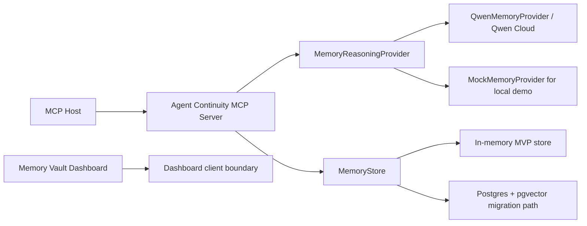

# Agent Continuity MCP Server

An MCP-native continuity layer that lets AI agents preserve user preferences, working procedures, tool experience, project context, and failure lessons across sessions, projects, and hosts.

## Problem

Modern AI agents are powerful, but their memory is fragmented:

- A new session often loses corrections, tool experience, and task history.
- Project-level files like `AGENTS.md` or `CLAUDE.md` help inside one repository, but do not fully solve cross-project user continuity.
- Codex, Claude Code, Cursor, and custom agents each maintain their own context systems.
- Users cannot easily inspect, approve, delete, or port memories across agents.

This project addresses the missing persistence layer between agents.

## Core Idea

Agent Continuity MCP Server does not replace existing agents. It exposes memory as an MCP server:

```text
Codex / Claude Code / Cursor / Custom Agent
        |
        | Remote MCP Streamable HTTP
        v
Agent Continuity MCP Server on Alibaba Cloud
        |
        v
Qwen Cloud + Postgres/pgvector + Memory Vault Dashboard
```

Every connected agent can:

- bootstrap a new session with the right continuity context,
- recall relevant long-term memories,
- write new durable memories,
- reflect on a completed run,
- forget or supersede outdated memories,
- explain which memories influenced an answer.

## Current MVP

This repository now contains a runnable integrated MVP:

- Remote Streamable HTTP MCP server at `/mcp`.
- Seven MCP tools, nine `memory://` resources, and four reusable prompts.
- `packages/memory-core` with memory records, lifecycle helpers, event log, traces, sensitive-data rejection, SQL migration, and an in-memory store.
- Provider adapter boundary with `MemoryReasoningProvider`, `MockMemoryProvider`, and `QwenMemoryProvider`.
- Next.js Memory Vault dashboard with vault, pending review, edit/delete, trace, and conflict-review views backed by a mock client boundary.
- AI Opportunity Scout demo fixtures and JSON-RPC examples.

Local development uses the in-memory store and `MockMemoryProvider` by default. Set `QWEN_API_KEY` or `DASHSCOPE_API_KEY` to use Qwen Cloud through `QwenMemoryProvider`.

## Quick Start

```bash
npm install
npm run dev:server
```

The server listens at:

```text
http://127.0.0.1:3000/mcp
```

If port 3000 is already in use, choose another port:

```bash
PORT=3333 npm run dev:server
```

Useful commands:

```bash
npm run build:server
npm run smoke
npm run test --workspace @agent-continuity/memory-core
npm run dashboard:dev
npm run dashboard:build
npm run demo:flow
npm run demo:jsonrpc
```

Call a tool manually:

```bash
MCP_ENDPOINT=http://127.0.0.1:3333/mcp npm run mcp:call -- memory_recall examples/http/payloads/memory-recall-rank-opportunities.json
```

## Why MCP

MCP already gives AI hosts a standard way to discover and call tools, read resources, and use reusable prompts. This project uses MCP as the agent memory interface:

- Tools: executable memory operations.
- Resources: readable memory vault views.
- Prompts: reusable memory-aware workflows.

The result is a memory system that is host-agnostic instead of tied to one agent runtime.

The MVP is remote-only. Local stdio is intentionally out of scope for the first version because the product value depends on one cloud memory layer shared across agents, sessions, projects, and devices.

## Why Qwen Cloud

Qwen Cloud powers the reasoning-heavy parts of memory:

- extracting durable memories from conversations and agent runs,
- classifying memories by type and scope,
- detecting conflicts between old and new memories,
- building token-budgeted context packs,
- reflecting on task outcomes,
- explaining why specific memories were used.

This makes Qwen Cloud the core memory reasoning engine, not a side integration.

The architecture is Qwen-first for the hackathon, but provider-agnostic long term. Qwen is implemented behind a `MemoryReasoningProvider` interface so future versions can add other providers without changing the memory core.

## Memory Types

```text
identity
user_preference
procedure
project_fact
tool_memory
decision_memory
failure_memory
outcome_memory
negative_preference
skill
```

Examples:

- User prefers AI agent hackathons that improve credentials and network.
- Before recommending an event, verify deadline, eligibility, and timezone.
- Devpost deadlines are usually shown in Pacific Time.
- Do not recommend competitions whose official rules exclude the user's region.

## MCP Tools

### `continuity_bootstrap`

Called at the start of a session. Returns a compact context pack for the current user, project, agent profile, host, and task.

### `memory_recall`

Retrieves relevant memories for a specific task or question.

### `memory_remember`

Extracts and stores durable memories from user corrections, task notes, or agent observations.

### `memory_reflect`

Reviews a completed agent run and creates procedure, tool, failure, decision, or outcome memories.

### `memory_update`

Edits, merges, or supersedes an existing memory.

### `memory_forget`

Deletes, invalidates, or expires an outdated memory.

### `memory_trace`

Shows which memories were used, ignored, or excluded from a context pack.

## MCP Resources

```text
memory://users/{user_id}/profile
memory://agents/{agent_profile_id}/procedures
memory://agents/{agent_profile_id}/failures
memory://projects/{project_id}/facts
memory://projects/{project_id}/tool-notes
memory://runs/{run_id}/summary
memory://traces/{trace_id}
memory://vault/pending
memory://vault/conflicts
```

## Architecture



## MVP Demo

Demo agent: AI Opportunity Scout.

Scenario:

1. In session one, the user teaches the agent their AI hackathon goals and preferences.
2. The MCP server stores user preference and procedure memories.
3. In a new session, the agent calls `continuity_bootstrap` and remembers the same priorities.
4. The agent ranks Qwen, TRAE, and CockroachDB opportunities consistently.
5. After a mistake, `memory_reflect` stores a failure memory so future sessions avoid the same error.
6. The dashboard shows which memories were used and lets the user approve, edit, or delete them.

## Hackathon Fit

Qwen Track 1 asks for persistent memory, cross-session interactions, user preferences, efficient retrieval, timely forgetting, and recall under limited context windows.

This project maps directly to those requirements:

| Track 1 requirement | Implementation |
| --- | --- |
| Persistent memory | Postgres + pgvector + event log |
| User preferences | `user_preference` memories |
| Cross-session interactions | `continuity_bootstrap` |
| Efficient retrieval | structured filters + vector search + Qwen reranking |
| Timely forgetting | expiry, superseding, invalidation |
| Limited context windows | token-budgeted context packs |
| Better decisions over time | `memory_reflect` + outcome/failure memories |

## MVP Stack

- TypeScript MCP server
- Node.js backend
- Remote Streamable HTTP MCP transport
- In-memory MVP store plus Postgres + pgvector schema/migration path
- Qwen Cloud API through `QwenMemoryProvider`
- Next.js / React dashboard
- Alibaba Cloud deployment

## Differentiation

Letta is a memory-first agent runtime.

Agent Continuity MCP Server is a memory infrastructure layer for any agent.

It is designed to make different agents behave like the same long-term collaborator without forcing users to migrate to a new runtime.

## References

- Qwen Cloud Hackathon: https://qwencloud-hackathon.devpost.com/
- MCP architecture: https://modelcontextprotocol.io/docs/learn/architecture
- MCP tools: https://modelcontextprotocol.io/specification/2025-06-18/server/tools
- Claude Code memory: https://code.claude.com/docs/en/memory
- Letta memory: https://docs.letta.com/letta-agent/memory
