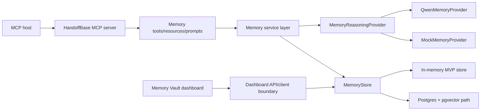

# HandoffBase

Open memory handoff for AI agents.

HandoffBase is an MCP-native memory layer that lets AI agents preserve, inspect,
and hand off user preferences, project context, procedures, failures, decisions,
and traces across sessions, hosts, and projects.

It is built as a Remote Streamable HTTP MCP server, with Qwen-backed memory
reasoning behind a provider interface, a traceable memory lifecycle, and a
Memory Vault dashboard prototype for review and governance.

Current status: runnable MVP. The local path uses an in-memory store and
`MockMemoryProvider` by default. The Alibaba Cloud proof is Qwen-backed and
authenticated, but still uses `storeMode=in-memory`; it is a deployment proof,
not a production SaaS service.

## Why HandoffBase

Modern AI agents are useful, but continuity is fragmented:

- New sessions forget corrections, tool experience, and prior outcomes.
- Repository files such as `AGENTS.md` or `CLAUDE.md` help inside one project,
  but do not provide portable cross-host user memory.
- Codex, Claude Code, Cursor, and custom agents each have their own context
  surface.
- Users need a way to inspect, approve, update, forget, and trace the memories
  that influence agent behavior.

HandoffBase treats memory as shared infrastructure. Agents connect through MCP,
call explicit memory tools, read `memory://` resources, and return auditable
trace ids instead of silently stuffing old chat history into prompts.

## Core Idea

```text
Codex / Claude Code / Cursor / custom MCP host
        |
        | Remote Streamable HTTP MCP
        v
HandoffBase MCP server
        |
        +--> MemoryReasoningProvider
        |       +--> QwenMemoryProvider
        |       +--> MockMemoryProvider
        |
        +--> MemoryStore
        |       +--> In-memory MVP store
        |       +--> Postgres + pgvector migration path
        |
        +--> Memory Vault dashboard prototype
```

Every connected agent can:

- bootstrap a new session with the right continuity context,
- recall relevant long-term memories for a task,
- remember new durable facts, procedures, preferences, and failures,
- reflect on completed runs,
- update, supersede, expire, or forget outdated memories,
- explain which memories were used, ignored, or excluded.

## What Is Implemented

| Area | Current implementation |
| --- | --- |
| MCP transport | Remote Streamable HTTP server at `/mcp` |
| MCP surface | 7 tools, 9 `memory://` resources, and 4 reusable prompts |
| Memory core | `@handoffbase/memory-core` with records, scopes, lifecycle, events, traces, validation, and sensitive-data rejection |
| Providers | `MemoryReasoningProvider`, `QwenMemoryProvider`, and deterministic `MockMemoryProvider` |
| Store | In-memory runtime store by default; `PostgresMemoryStore` and pgvector SQL migration path exist for future runtime wiring |
| Dashboard | Next.js Memory Vault prototype with vault, pending review, edit/delete, trace, and conflict review views |
| Demo | Deterministic AI Opportunity Scout flow and JSON-RPC/HTTP example payloads |
| Deployment proof | Alibaba Cloud ECS + Docker proof with API-key auth, Qwen provider mode, and in-memory store mode |

## Quickstart

Requires Node.js 22 or newer.

```bash
npm install
npm run check
npm run dev:server
```

The local MCP server listens at:

```text
http://127.0.0.1:3000/mcp
```

If port 3000 is already in use:

```bash
PORT=3333 npm run dev:server
```

Call a local tool with the included Opportunity Scout payload:

```bash
MCP_ENDPOINT=http://127.0.0.1:3333/mcp npm run mcp:call -- memory_recall examples/http/payloads/memory-recall-rank-opportunities.json
```

Useful commands:

```bash
npm run smoke
npm run test
npm run dashboard:dev
npm run demo:flow
npm run demo:jsonrpc
```

`npm run check` is the CI-parity command. It typechecks, builds the server and
workspaces, runs the MCP registration smoke test, and runs memory-core, auth,
server, and dashboard tests. It must pass without Qwen credentials.

## Qwen Setup

Local development works without cloud credentials by using `MockMemoryProvider`.
To exercise the Qwen-backed path:

```bash
cp .env.example .env.local
```

Then set one of these credentials in your local or cloud environment:

- `QWEN_API_KEY`
- `DASHSCOPE_API_KEY`

Optional Qwen/DashScope settings:

- `QWEN_BASE_URL` or `DASHSCOPE_BASE_URL`
- `QWEN_MODEL` or `DASHSCOPE_MODEL`
- `QWEN_TIMEOUT_MS`

Never commit `.env.*` files. Keep Qwen keys, DashScope keys, HandoffBase API
keys, database URLs, cloud credentials, cookies, and auth headers in local or
cloud secret configuration only.

Qwen is used for the reasoning-heavy memory work:

- extracting durable memories from conversations, run summaries, and tool notes,
- classifying type, scope, importance, and validity,
- detecting conflicts with existing memory,
- building token-budgeted context packs,
- reflecting on completed agent runs,
- explaining memory usage traces.

The memory core remains provider-agnostic. Qwen-specific logic lives behind
`QwenMemoryProvider`; the default local/test path remains mock-provider
compatible.

## Connect Via MCP

HandoffBase is remote-first. MCP hosts should connect to the Streamable HTTP
endpoint exposed by the server:

```text
http://127.0.0.1:3000/mcp
```

For deployed environments, put HTTPS and API-key auth in front of the service
before using it with real data. Remote clients can authenticate with either a
bearer token or `X-Handoffbase-Api-Key`; keep the key value in the host's secret
configuration, not in tracked project files.

The MCP server exposes tools for memory actions, resources for readable vault
views, and prompts for memory-aware workflows. Local stdio is intentionally not
the MVP path because the product value comes from one shared memory layer across
hosts and sessions.

## Remote MCP Validation

The repo includes a remote validator:

```bash
npm run mcp:validate-remote
```

Before running it, set `MCP_ENDPOINT` to a deployed `/mcp` URL and set
`MCP_AUTH_TOKEN` in your shell or secret manager. Do not paste token values into
tracked files or command logs.

The validator checks:

- `GET /health` reports `authMode=api_key`, `providerMode=qwen`, and
  `storeMode=in-memory`,
- MCP `tools/list` returns the registered tools,
- authenticated `memory_recall` returns memories and a trace id,
- authenticated `memory_remember` exercises the Qwen-backed provider path.

The current deployment evidence is recorded in
[`docs/deployment/alibaba-cloud-proof.md`](docs/deployment/alibaba-cloud-proof.md).
It is a temporary Alibaba Cloud ECS proof using public HTTP, not a production
TLS endpoint or managed SaaS service.

## MCP Tools

| Tool | Purpose |
| --- | --- |
| `continuity_bootstrap` | Build a compact continuity context pack for a new session. |
| `memory_recall` | Recall relevant memories for a task, query, and scope. |
| `memory_remember` | Create durable memory candidates from corrections, notes, or observations. |
| `memory_reflect` | Reflect on a completed agent run and propose durable memories. |
| `memory_update` | Edit, merge, or supersede an existing memory record. |
| `memory_forget` | Invalidate, archive, expire, or delete an existing memory record. |
| `memory_trace` | Explain which memories were used, ignored, or excluded. |

## MCP Resources

| Resource | Purpose |
| --- | --- |
| `memory://users/{user_id}/profile` | Readable continuity profile for a user. |
| `memory://agents/{agent_profile_id}/procedures` | Procedure memories scoped to an agent profile. |
| `memory://agents/{agent_profile_id}/failures` | Failure memories scoped to an agent profile. |
| `memory://projects/{project_id}/facts` | Project fact memories. |
| `memory://projects/{project_id}/tool-notes` | Tool memories scoped to a project. |
| `memory://runs/{run_id}/summary` | Summary for a remembered agent run. |
| `memory://traces/{trace_id}` | Trace detail for memory selection and exclusion. |
| `memory://vault/pending` | Pending memory candidates awaiting review. |
| `memory://vault/conflicts` | Memory conflicts awaiting resolution. |

## MCP Prompts

| Prompt | Purpose |
| --- | --- |
| `memory-aware-start` | Start a session by bootstrapping continuity context before acting. |
| `post-run-reflection` | Review a completed run and identify durable memories. |
| `memory-review` | Guide pending memory review decisions. |
| `conflict-resolution` | Resolve conflicts between existing and proposed memories. |

## Memory Lifecycle

| Stage | What happens |
| --- | --- |
| Remember | `memory_remember` extracts candidate memories from explicit notes, corrections, or observations. |
| Review | Candidates can remain `pending` for user or dashboard review before activation. |
| Recall | `memory_recall` retrieves scoped, valid memories and returns a trace id. |
| Bootstrap | `continuity_bootstrap` builds a token-budgeted context pack for a new host/session. |
| Reflect | `memory_reflect` turns run outcomes into procedure, decision, tool, failure, or outcome memories. |
| Trace | `memory_trace` and `memory://traces/{trace_id}` explain selected, ignored, and excluded memories. |
| Update | `memory_update` edits, merges, or supersedes stale or conflicting memories. |
| Forget | `memory_forget` invalidates, archives, expires, or deletes memory records. |

Memory types currently modeled:

```text
identity
user_preference
procedure
project_fact
tool_memory
decision_memory
failure_memory
outcome_memory
negative_preference
skill
```

## Inspection And Governance

HandoffBase is designed so users and operators can see how memory affects
answers:

- `memory_trace` explains which memories were used, ignored, or excluded.
- `memory://traces/{trace_id}` exposes trace details through MCP resources.
- `memory://vault/pending` exposes pending memory candidates.
- `memory://vault/conflicts` exposes open conflict records.
- The Memory Vault dashboard prototype shows vault, pending review, trace, and
  conflict-review views through a dashboard client boundary.

This is not only retrieval. The memory lifecycle is meant to be governed:
pending approval, conflict review, supersession, expiry, deletion, and trace
inspection are first-class behaviors.

## Architecture



More detail:

- [Technical design](docs/technical-design.md)
- [Deployment notes](docs/deployment.md)
- [Alibaba Cloud deployment proof](docs/deployment/alibaba-cloud-proof.md)
- [Development and public-readiness checklist](docs/dev-materials-checklist.md)
- [Current handoff](docs/handoff.md)

## Examples And Demo

- [AI Opportunity Scout demo flow](demo/opportunity-scout/demo-flow.md)
- [HTTP JSON-RPC examples](examples/http/opportunity-scout.http)
- `examples/http/payloads/*` for direct MCP tool payloads
- `npm run demo:flow` for an offline narration
- `npm run demo:jsonrpc` for JSON-RPC request examples

The demo shows a user teaching an opportunity-scouting agent their hackathon
preferences, a later session recalling those preferences, a failure reflection
creating a future guardrail, and another host receiving the same scoped memory
through MCP.

## Comparison

HandoffBase is not positioned as universally better than existing memory
systems. The current goal is narrower: MCP-native, traceable, governed memory
handoff across agents and hosts.

| Project | Strong fit | HandoffBase difference |
| --- | --- | --- |
| [Mem0](https://docs.mem0.ai/introduction) | Universal memory layer, hosted/open-source memory, agent plugins, framework integrations. | HandoffBase is Remote MCP first: tools, resources, prompts, trace ids, and user-governed memory vault resources are the product surface. |
| [Zep](https://help.getzep.com/overview) | Enterprise-scale agent memory with temporal graph/context infrastructure. | HandoffBase is a lighter MCP-native handoff layer; the current MVP does not claim graph-scale enterprise retrieval. |
| [Letta](https://docs.letta.com/) | Memory-first agent runtime with agents, tools, blocks, channels, and app/server surfaces. | HandoffBase does not require migrating to a new agent runtime; it sits beside existing MCP hosts. |
| [LangMem](https://langchain-ai.github.io/langmem/) | LangGraph/LangChain-oriented memory primitives, background managers, and memory tools. | HandoffBase is host-agnostic infrastructure exposed as a Remote Streamable HTTP MCP service. |

## Eval Awareness

The repo currently includes deterministic checks and demo fixtures rather than
published benchmark claims:

- MCP registration smoke test,
- memory-core lifecycle, validation, sanitizer, and Postgres contract tests,
- auth and server route tests,
- dashboard API tests,
- deterministic Opportunity Scout session fixtures.

Future eval work should measure cross-session recall quality, conflict
detection precision, trace completeness, forgetting behavior, token-budget
packing, and whether remembered procedures improve agent decisions without
over-recalling irrelevant context.

## Current Limitations

- The live Alibaba Cloud proof is Qwen-backed but uses `storeMode=in-memory`.
- `PostgresMemoryStore` and the SQL migration path exist, but runtime
  `STORE_MODE=postgres` wiring is future work.
- The public ECS proof uses HTTP on a demo endpoint; production use should add
  TLS, domain routing, hardened auth, durable storage, monitoring, and a managed
  deployment path.
- The Memory Vault dashboard is a governance prototype, not a full production
  admin console.
- The repo does not currently include standalone comparison, eval, dashboard
  demo, or examples README files in this checkout.
- No benchmark results are claimed here.

## License

TODO: add a `LICENSE` file before public release. If the
`codex/license-and-examples` branch is merged first, replace this section with
the selected open-source license.
