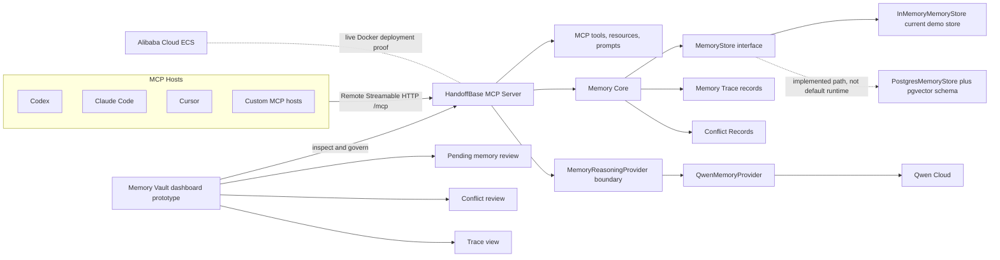

# HandoffBase Architecture

HandoffBase is an MCP-native memory handoff layer for AI agents. It is not an
agent runtime, a generic vector store wrapper, or a project-local note file. Its
job is to expose durable memory operations through MCP so different hosts can
share the same governed continuity layer without changing their own runtimes.

The current project is in open-source and star-readiness mode. The live proof is
intentionally narrow: a Remote Streamable HTTP MCP server on Alibaba Cloud ECS,
Qwen-backed memory reasoning, API key auth, and an in-memory runtime store.

## System Shape



The standalone Mermaid source lives in
[`docs/assets/architecture.mmd`](assets/architecture.mmd).

## Host Boundary

HandoffBase is designed for hosts that can speak MCP:

- Codex
- Claude Code
- Cursor
- custom MCP hosts

Hosts do not need to adopt a new agent runtime. They connect to the HandoffBase
MCP endpoint, discover tools/resources/prompts, and call memory operations during
normal agent work.

The first version is remote-only. Local stdio transport is not part of the MVP
because the product value is a shared cloud memory layer across sessions,
projects, hosts, and devices.

## MCP Server Boundary

The MCP server exposes a Remote Streamable HTTP endpoint at `/mcp`. The current
manifest contains seven tools, nine `memory://` resources, and four prompts.
Tool names, resource URIs, and prompt names are part of the public interface and
should not change without an explicit compatibility decision.

The server layer stays thin. It resolves caller scope, enforces auth/scope
guards, validates tool inputs, and delegates memory behavior to the service and
core packages.

## Reasoning Boundary

Qwen Cloud powers reasoning-heavy memory operations in the hackathon version:

- extracting durable memories from user corrections, task notes, and run output
- classifying memory type, scope, confidence, importance, and validity
- detecting conflicts between candidate and existing memories
- building token-budgeted context packs
- reflecting on completed runs
- explaining why memories were selected or ignored

Qwen is isolated behind the `MemoryReasoningProvider` boundary. The concrete
adapter is `QwenMemoryProvider`; the local and CI-safe path is
`MockMemoryProvider`. This keeps Memory Core provider-agnostic and prevents MCP
handlers from calling Qwen directly.

Provider input is sanitized before prompt construction. The sanitizer redacts or
rejects obvious secrets and truncates oversized structures so raw tool logs,
headers, cookies, private keys, and credential-like values do not become prompt
payloads.

## Memory Core Boundary

`packages/memory-core` is the provider-neutral domain package. It defines:

- memory types and lifecycle statuses
- scoped `MemoryRecord` objects
- `MemoryStore`
- events
- runs
- traces
- embeddings
- conflict records
- validation and sensitive-data checks

The core durable object is canonical memory text with metadata. Raw source is
optional; HandoffBase should not persist full raw chat logs by default.

## Store Boundary

`MemoryStore` is the storage interface used by the service layer.

`InMemoryMemoryStore` is the current live demo store. The deployed `/health`
proof reports `storeMode=in-memory`, so stored demo memories are not durable
across process restarts.

`PostgresMemoryStore` is an implemented path in `packages/memory-core`. It
supports core CRUD, recall, traces, events, embeddings, and conflicts, and the
repository includes a Postgres/pgvector migration contract. It is not wired as
the default server runtime yet. Do not claim production persistence until runtime
store selection and database provisioning are explicitly completed and
validated.

## Trace Governance

Recall is not a black box. `continuity_bootstrap` and `memory_recall` return a
trace id for the final context pack that the host receives. `memory_trace` and
`memory://traces/{trace_id}` expose which memories were selected, ignored, or
excluded and why.

This matters because a memory system can silently shape agent behavior. Trace
records make context selection inspectable and give users a way to audit why an
agent carried a lesson forward.

## Conflict Governance

Conflict records are first-class governance records. When Qwen detects a
contradiction, duplicate, supersede candidate, or scope overlap, HandoffBase can
hold the candidate as `pending` and write a conflict record instead of silently
overwriting active memory.

This supports review flows such as:

- ask the user before replacing an important preference
- merge two overlapping procedure memories
- supersede stale facts explicitly
- keep both memories when scopes are different
- reject unsafe or low-confidence candidates

The important property is not that HandoffBase always knows the right answer. It
is that changes to durable memory are reviewable rather than invisible.

## Memory Vault Dashboard

The Memory Vault dashboard is a Next.js prototype for inspecting and governing
memory. The current app includes vault, pending review, edit/delete, trace, and
conflict-review views behind a client boundary.

The dashboard defaults to mock data for local development. It can call same
origin dashboard API routes when `NEXT_PUBLIC_HANDOFFBASE_DASHBOARD_CLIENT=http`
is set, but it is not yet the source of production-grade persistence.

## Live Deployment Proof

The deployed proof is recorded in
[`docs/deployment/alibaba-cloud-proof.md`](deployment/alibaba-cloud-proof.md).
It shows a single Alibaba Cloud ECS instance running the Dockerized server.

Current live `/health` proof:

```text
authMode=api_key
providerMode=qwen
storeMode=in-memory
```

Remote validation has succeeded for MCP discovery, `memory_recall`, and
Qwen-backed `memory_remember` through `npm run mcp:validate-remote`.

## Current Limitations

- Runtime storage is still in-memory on the live proof.
- Postgres/pgvector is implemented as a path but not wired as the default
  runtime.
- The public ECS endpoint is HTTP on an IP address, without domain, TLS, load
  balancer, or managed gateway.
- The dashboard is a prototype and defaults to mock data.
- HandoffBase should not claim to be more mature or more production-ready than
  established managed memory platforms.

These limits are part of the architecture story. HandoffBase is serious
infrastructure because the boundaries are explicit: MCP interface, reasoning
provider, memory core, storage adapter, trace records, conflict records, and user
governance.
