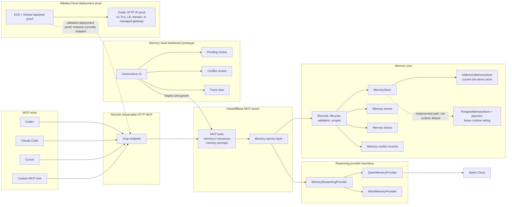

# Architecture For Devpost

HandoffBase is a Remote Streamable HTTP MCP memory layer for AI agents. Codex,
Claude Code, Cursor, and custom MCP hosts connect to one `/mcp` endpoint, call
memory tools, read `memory://` resources, and receive trace ids for the memory
context that shaped a run.

The current implementation is intentionally honest in scope. The backend proof
ran on Alibaba Cloud ECS with Docker, API-key auth, Qwen-backed reasoning, and
the in-memory demo store. The ECS instance has since been stopped to reduce
cost, so the proof should be treated as validated deployment evidence, not as a
currently online production endpoint.

## Diagram

Source: [docs/assets/architecture.mmd](../assets/architecture.mmd)

## Qwen Role

Qwen powers the reasoning-heavy parts of the hackathon architecture behind the
`MemoryReasoningProvider` boundary. The concrete adapter is
`QwenMemoryProvider`; local development and CI can use `MockMemoryProvider`
without credentials.

Qwen is used for:

- extracting durable memories from conversations, run summaries, and task notes
- classifying memory type, scope, importance, confidence, and validity
- detecting conflicts with existing memory
- packing relevant memories into token-budgeted context
- reflecting on completed runs
- explaining trace decisions for selected, ignored, and excluded memories

Qwen-specific code stays behind the provider adapter so Memory Core remains
provider-agnostic.

## Alibaba Cloud Role

Alibaba Cloud is the deployment proof for the backend. The project has evidence
of an ECS instance running the Dockerized HandoffBase server with `/health`, MCP
`tools/list`, authenticated `memory_recall`, and Qwen-backed
`memory_remember` validation.

The proof demonstrates ECS + Docker backend deployment. It does not claim a
managed SaaS stack, durable cloud database, TLS endpoint, load balancer, domain,
or managed gateway.

## Current Store

The live proof used `storeMode=in-memory`. `InMemoryMemoryStore` is therefore
the current live demo store, and data should not be described as durable across
process restarts.

`PostgresMemoryStore` and a pgvector migration path exist in the memory-core
package, but they are future runtime wiring. HandoffBase should not claim
Postgres-backed live persistence until runtime selection, database provisioning,
and validation are completed.

## Dashboard

The Memory Vault dashboard is a governance UI prototype. It is meant to show
how users and operators inspect memory, review pending candidates, inspect
trace decisions, and resolve conflicts instead of letting agent memory mutate
silently.

The dashboard supports the product story, but it is not yet a production admin
console or the source of durable persistence.

## Current Limitations

- The ECS proof is currently stopped to reduce cost; do not assume the endpoint
  is online.
- The deployed proof used public HTTP on an IP address.
- No TLS certificate, custom domain, load balancer, or managed gateway is part
  of the current proof.
- Runtime storage for the live proof is in-memory.
- Postgres/pgvector exists as an implemented path, not as the default runtime.
- The Memory Vault dashboard is a prototype.
- HandoffBase should not be described as production SaaS ready.

## Render Instructions

No Mermaid export CLI is included in this repository. To create a submission
image without adding dependencies:

1. Open [docs/assets/architecture.mmd](../assets/architecture.mmd).
2. Paste the source into Mermaid Live Editor, or preview the Mermaid block in
   GitHub Markdown.
3. Export SVG or PNG from the preview.
4. Confirm the exported image contains no console output, browser session data,
   credentials, auth headers, API keys, database URLs, coupon/voucher codes, or
   cloud account details.
