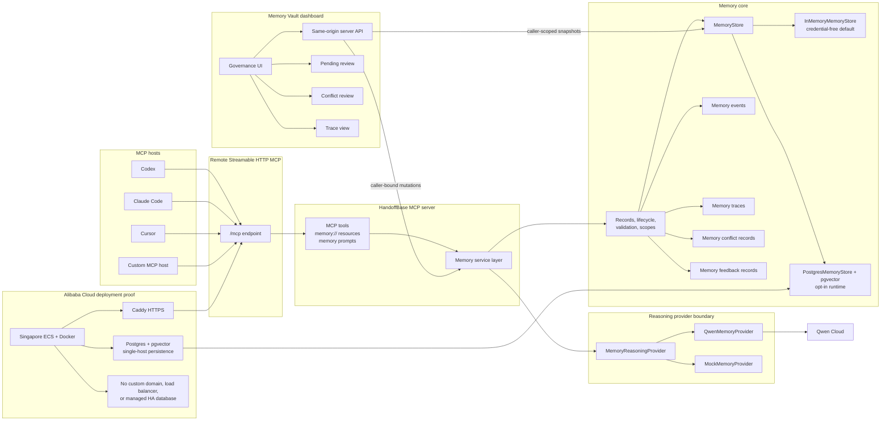

# Architecture For Devpost

HandoffBase is a Remote Streamable HTTP MCP memory layer for AI agents. Codex,
Claude Code, Cursor, and custom MCP hosts connect to one `/mcp` endpoint, call
memory tools, read `memory://` resources, and receive trace ids for the memory
context that shaped a run.

The current implementation is intentionally honest in scope. The live judging
backend runs on Alibaba Cloud International ECS in Singapore with Docker,
Caddy HTTPS, API-key auth, Qwen reasoning and embeddings, and
Postgres/pgvector. The credential-free local default remains in-memory; the
live deployment uses durable single-host Postgres storage.

## Diagram

Source: [docs/assets/architecture.mmd](../assets/architecture.mmd)

## Qwen Role

Qwen powers the reasoning-heavy parts of the hackathon architecture behind the
`MemoryReasoningProvider` boundary. The concrete adapter is
`QwenMemoryProvider`; local development and CI can use `MockMemoryProvider`
without credentials.

Qwen is used for:

- extracting durable memories from conversations, run summaries, and task notes
- classifying memory type, scope, importance, confidence, and validity
- detecting conflicts with existing memory
- packing relevant memories into token-budgeted context
- reflecting on completed runs
- explaining trace decisions for selected, ignored, and excluded memories

Qwen-specific code stays behind the provider adapter so Memory Core remains
provider-agnostic.

## Alibaba Cloud Role

Alibaba Cloud hosts the live judging backend. The Singapore ECS instance runs
the Dockerized HandoffBase server, Postgres/pgvector, an explicit migration, and
Caddy HTTPS. Public-hostname validation covered `/health`, authenticated `/ready`,
the exact MCP `tools/list` manifest, `memory_recall`, and Qwen-backed
`memory_remember` with persisted candidates. An exact memory remained after an
application restart.

The proof demonstrates a working ECS + Docker backend with HTTPS and durable
single-host Postgres storage. It does not claim a managed SaaS stack, multi-zone
database availability, a custom product domain, a load balancer, or a managed
gateway.

## Current Store

The live Singapore deployment reports `storeMode=postgres` and
`embeddingMode=qwen`. It runs `PostgresMemoryStore` against Postgres/pgvector
after the explicit migration. Restart validation proved process-restart
persistence, and the final database contained memory, trace, and embedding rows.

`InMemoryMemoryStore` remains the credential-free default for local development
and deterministic tests. The live Postgres volume is on one ECS host, while a
verified logical backup was copied off ECS. This proves application-restart
persistence, not managed multi-zone availability or managed backups.

## Dashboard

The Memory Vault dashboard is a governance UI. It is meant to show
how users and operators inspect memory, review pending candidates, inspect
trace decisions, and resolve conflicts instead of letting agent memory mutate
silently.

The browser uses same-origin server APIs by default. An API-key sign-in creates
a signed HttpOnly caller session; mutation routes then call the same
`ContinuityMemoryService` governance boundary as MCP, while direct store access
is limited to caller-scoped snapshots and audit reads. The backend follows the
MCP runtime's `STORE_MODE` and `DATABASE_URL`, and Postgres mode disables demo
seeding. It is not yet a production admin console.

## Current Limitations

- The live endpoint is API-key protected; the temporary judge token belongs
  only in private Devpost testing instructions.
- TLS uses a free `sslip.io` hostname rather than a custom product domain.
- Postgres and Caddy state are on one ECS host; the verified logical backup is
  off-server, but neither the database nor backup is a managed HA service.
- The local default remains in-memory even though the live Alibaba runtime uses
  Postgres/pgvector.
- The Memory Vault dashboard is server-backed but not production hardened.
- HandoffBase should not be described as production SaaS ready.

## Render Instructions

No Mermaid export CLI is included in this repository. To create a submission
image without adding dependencies:

1. Open [docs/assets/architecture.mmd](../assets/architecture.mmd).
2. Paste the source into Mermaid Live Editor, or preview the Mermaid block in
   GitHub Markdown.
3. Export SVG or PNG from the preview.
4. Confirm the exported image contains no console output, browser session data,
   credentials, auth headers, API keys, database URLs, coupon/voucher codes, or
   cloud account details.
