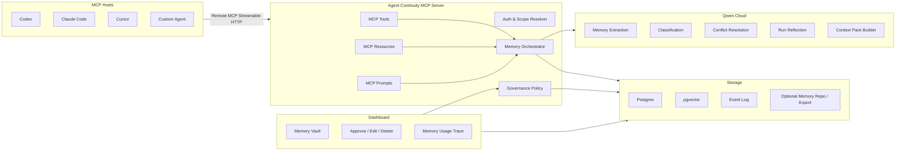
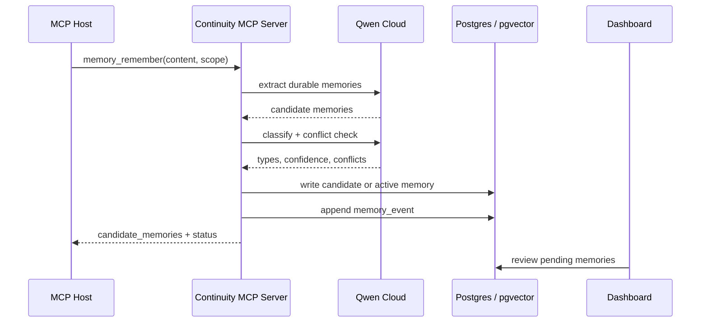
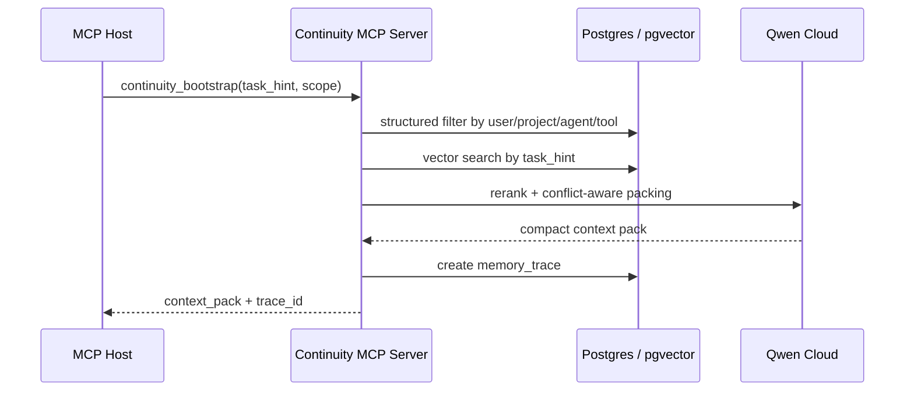

# Agent Continuity MCP Server 技术方案

版本: 0.1
日期: 2026-07-06
目标赛道: Qwen Cloud Hackathon Track 1 - MemoryAgent

## 1. 一句话定位

Agent Continuity MCP Server 是一个 MCP-native 的 Agent 记忆与连续性层。它不替代 Claude Code、Codex、Cursor 或其他 Agent，而是通过 MCP 为它们提供可迁移、可审计、可治理的长期记忆，让不同 Agent 在不同 session、项目和工具环境中保持一致的工作方式、偏好、经验和判断标准。

英文定位:

> A portable continuity layer for AI agents, exposed through MCP, that lets agents preserve user preferences, working procedures, tool experience, project context, and failure lessons across sessions, projects, and hosts.

## 2. 要解决的问题

现在的 coding agent 和 general agent 已经很强，但它们的连续性仍然是局部的:

- Session 断裂: 当前对话里的修正、失败尝试、工具经验，新开 session 后经常丢失或需要重新解释。
- Project 断裂: 每个 repo 可以有 `AGENTS.md`、`CLAUDE.md` 或项目 memory，但用户跨项目的稳定偏好和工作方式无法自然迁移。
- Agent 断裂: Codex、Claude Code、Cursor、自研 Agent 等各自维护自己的上下文机制；一个工具里学到的经验，另一个工具通常不知道。
- Governance 缺口: Agent 记住了什么、为什么使用这条记忆、记忆是否过期、能否迁移到其他工具，通常不可统一管理。

因此核心问题不是“如何让一个聊天机器人记住用户偏好”，而是:

> 如何让多个不同 Agent 在不同 session 和项目里像同一个长期协作者一样工作。

## 3. 产品边界

### 做什么

- 作为 MCP Server 暴露长期记忆能力。
- 让任意 MCP Host 通过标准 MCP tools/resources/prompts 接入记忆。
- 提供 user memory、agent memory、project memory、tool memory、failure memory、procedure memory。
- 使用 Qwen Cloud 做记忆抽取、分类、冲突判断、反思总结和 context pack 生成。
- 提供 dashboard 让用户查看、批准、编辑、删除、导出记忆。
- 为每次回答返回“本次使用了哪些记忆”的解释。

### 不做什么

- 不做完整 Agent runtime，不和 Letta 正面竞争。
- 不要求用户放弃 Codex、Claude Code、Cursor 等已有工具。
- 不默认保存完整聊天记录；只保存经过抽取和治理的 durable memory。
- 不把 memory 当成不可控黑盒；所有持久记忆都应可审计、可删除。
- 不把“必须遵守的安全/团队规则”只放进 memory。硬规则仍应在 host 的官方配置、repo 文档、hooks 或权限系统中落地。

## 4. 和 Letta / MemGPT 的关系

Letta / MemGPT 证明了 stateful agent + self-editing memory 是正确方向。它的核心形态是:

- 一个长期存在的 agent。
- agent 有 memory、model config、message history 和 tools。
- memory 存在 MemFS / memory blocks / archival memory 中。
- agent 可以通过 dream / sleep-time compute 自我整理记忆。

本方案的差异是:

| 维度 | Letta / MemGPT | Agent Continuity MCP Server |
| --- | --- | --- |
| 产品形态 | Stateful agent runtime | Agent-agnostic memory infrastructure |
| 用户是否换 agent | 需要使用 Letta agent | 不需要，接入任意 MCP host |
| MCP 角色 | Letta agent 消费外部 MCP tools | 本产品本身就是 memory MCP server |
| 记忆归属 | 绑定 Letta agent/runtime | 绑定用户、项目、agent profile 和 tool scope |
| 主要价值 | 一个 agent 越用越懂你 | 多个 agent 像同一个协作者一样延续能力 |

一句话差异:

> Letta is a memory-first agent runtime. This project is an MCP-native continuity layer for any agent.

## 5. 总体架构



## 6. 核心模块

### 6.1 MCP Server Layer

负责暴露 MCP 标准能力:

- `tools/list`
- `tools/call`
- `resources/list`
- `resources/read`
- `prompts/list`
- `prompts/get`

首版只支持 Remote Streamable HTTP:

- Agent 通过一个远程 MCP endpoint 连接 memory server，例如 `https://api.example.com/mcp`。
- 后端部署在 Alibaba Cloud，满足比赛部署证明。
- 所有 host、session、project 共享同一套云端 memory store，正好体现产品的 cross-agent / cross-session / cross-project 连续性。
- Local stdio 不进入首版范围。后续如有需要，可以做一个 thin local wrapper，把 stdio 请求转发到远程 MCP endpoint，但这不是 MVP 必需能力。

选择 remote-only 的原因:

- 产品核心是跨设备、跨 host、跨项目的记忆连续性，本地 stdio 容易把价值收窄成本机插件。
- 比赛要求展示 Alibaba Cloud backend，remote MCP server 是最直接的证明方式。
- Dashboard、认证、审计、导出和多 host 共享都更适合云端服务形态。

### 6.2 Scope Resolver

把一次 MCP 调用映射到正确的 memory scope。

核心 scope:

- `user_id`: 谁的长期偏好和工作方式。
- `agent_profile_id`: 当前 agent 的身份，比如 coding-agent、research-agent、opportunity-scout。
- `host_id`: Codex、Claude Code、Cursor、自研 host。
- `project_id`: 当前 repo 或 workspace。
- `session_id`: 当前一次对话或任务。
- `tool_id`: 外部工具、API、网站、MCP server。

scope 的设计目标是避免两个极端:

- 记忆过窄: 每个项目/工具都重新学习。
- 记忆过宽: 一个项目里的临时经验污染所有项目。

### 6.3 Memory Orchestrator

负责完整 pipeline:

1. 接收 host 的记忆写入、召回、复盘请求。
2. 调用 Qwen Cloud 做抽取、分类、冲突判断。
3. 执行去重、合并、过期、权限检查。
4. 写入结构化存储、向量索引和 event log。
5. 在召回时生成 compact context pack。

### 6.4 Qwen Cloud Reasoning Layer

Qwen Cloud 不只是普通 chat completion，而是 Track 1 的核心 reasoning engine:

- 从任务记录中抽取 durable memory。
- 判断一条信息是 user preference、procedure、tool note、failure lesson 还是 project fact。
- 判断新旧记忆是否冲突。
- 为记忆生成简洁、可复用、低 token 的 canonical text。
- 对一次 agent run 做 post-run reflection。
- 根据当前任务生成 context pack，并解释每条记忆为什么被选中。

### 6.5 Storage Layer

首版建议:

- Postgres: 结构化 memory、scope、policy、event log。
- pgvector: 语义召回。
- OSS 或本地文件: 导出、备份、公开 demo 资产。
- 可选 memory repo: 类似 Letta 的 git-backed memory export，但不作为 MVP 的强依赖。

### 6.6 Dashboard

用户需要看到并控制 agent 的长期记忆:

- Memory Vault: 按 user / project / agent / tool / type 查看。
- Pending Memories: 需要用户批准的记忆。
- Memory Trace: 某次回答用了哪些记忆。
- Conflict Review: 新旧记忆冲突时让用户确认。
- Export / Delete: 可导出、可删除、可迁移。

## 7. 记忆类型

```ts
type MemoryType =
  | "identity"
  | "user_preference"
  | "procedure"
  | "project_fact"
  | "tool_memory"
  | "decision_memory"
  | "failure_memory"
  | "outcome_memory"
  | "negative_preference"
  | "skill";
```

### 7.1 Identity Memory

关于用户和 agent profile 的长期身份。

示例:

- 用户希望 agent 像务实的 senior engineer 一样工作。
- 当前 agent profile 是 AI Opportunity Scout。

### 7.2 User Preference

用户稳定偏好。

示例:

- 用户偏好中文沟通，但技术文档可以英文。
- 用户希望推荐 AI 活动时优先看背书、人脉、资源，而不是单纯奖金。

### 7.3 Procedure Memory

Agent 应长期执行的工作方式。

示例:

- 推荐比赛前必须核对 deadline、eligibility、timezone。
- 改代码前先读相关文件，避免直接猜。

### 7.4 Project Fact

项目内事实。

示例:

- 某 repo 使用 pnpm。
- 某 app 的入口在 `apps/desktop/src/renderer/App.tsx`。

### 7.5 Tool Memory

关于工具、API、网站、MCP server 的经验。

示例:

- Devpost 页面 deadline 是 PDT，需要转换为 Asia/Shanghai。
- 某 API 返回字段 `starts_at` 是 UTC。

### 7.6 Failure Memory

避免重复犯错。

示例:

- 之前推荐过已过期活动，用户纠正过；以后必须先查日期。
- 某命令在 sandbox 下会因为写 `~/.cache` 失败，需要申请授权。

### 7.7 Decision / Outcome Memory

记录某次判断和后续结果。

示例:

- Qwen Hackathon 被标记为 P0，因为最贴合 MemoryAgent 且 deadline 最近。
- Slack Agent Builder Challenge 因地区限制不推荐。

## 8. MCP Tools 设计

### 8.1 `continuity_bootstrap`

用于新 session 开始时给 agent 注入“灵魂包”。

输入:

```json
{
  "host": "codex",
  "agent_profile": "coding-agent",
  "user_id": "user_123",
  "project": {
    "root": "/path/to/repo",
    "git_remote": "git@github.com:org/repo.git",
    "name": "my-project"
  },
  "task_hint": "Find suitable AI hackathons and update Notion",
  "token_budget": 1800
}
```

输出:

```json
{
  "context_pack": {
    "user": ["User prefers concise Chinese updates."],
    "procedures": ["Before recommending events, verify deadline and eligibility."],
    "project": ["AI Event 2026 Notion tracker is the source of truth."],
    "tool_memory": ["Devpost deadlines are usually displayed in Pacific Time."],
    "failure_memory": ["Do not assume latest event status without browsing."]
  },
  "memory_trace_id": "trace_abc",
  "suggested_next_tools": ["memory_recall", "memory_reflect"]
}
```

### 8.2 `memory_recall`

按当前任务召回相关记忆。

输入:

```json
{
  "query": "Should this new AI hackathon be P0 or P1?",
  "scopes": {
    "user_id": "user_123",
    "project_id": "ai-event-2026",
    "agent_profile_id": "opportunity-scout"
  },
  "types": ["user_preference", "procedure", "failure_memory", "decision_memory"],
  "limit": 8,
  "token_budget": 900
}
```

输出:

```json
{
  "memories": [
    {
      "id": "mem_01",
      "type": "user_preference",
      "text": "User prioritizes AI events that improve credential, network, and founder resources.",
      "score": 0.92,
      "reason": "Directly affects event prioritization."
    }
  ],
  "context_block": "Use these memories when ranking the event: ...",
  "trace_id": "trace_123"
}
```

### 8.3 `memory_remember`

把新的经验写入 memory。默认可配置为 pending，需要用户批准后变成 active。

输入:

```json
{
  "source": "user_correction",
  "content": "以后推荐黑客松之前，必须先确认报名截止日期和地区资格。",
  "scopes": {
    "user_id": "user_123",
    "agent_profile_id": "opportunity-scout"
  },
  "approval_mode": "pending"
}
```

输出:

```json
{
  "candidate_memories": [
    {
      "type": "procedure",
      "text": "Before recommending hackathons, verify registration deadline and regional eligibility.",
      "confidence": 0.96,
      "status": "pending"
    }
  ]
}
```

### 8.4 `memory_reflect`

对一次 agent run 做复盘，沉淀 tool memory、failure memory、decision memory。

输入:

```json
{
  "run_id": "run_123",
  "summary": "Agent searched Devpost and Notion, added seven events, skipped Slack challenge due eligibility.",
  "messages": [],
  "tool_calls": [],
  "outcome": "user accepted priority list"
}
```

输出:

```json
{
  "new_memories": [
    {
      "type": "tool_memory",
      "text": "For Devpost hackathons, inspect official rules for eligibility before recommending."
    },
    {
      "type": "decision_memory",
      "text": "Qwen Cloud Hackathon was prioritized as P0 because deadline was imminent and Track 1 matched user's agent-memory direction."
    }
  ],
  "invalidated_memories": []
}
```

### 8.5 `memory_update`

修正、合并或替换旧记忆。

输入:

```json
{
  "memory_id": "mem_123",
  "patch": {
    "text": "User now prioritizes events with founder network and resource access over pure prize money.",
    "valid_from": "2026-07-06"
  },
  "supersede_conflicting": true
}
```

### 8.6 `memory_forget`

删除、失效或归档记忆。

输入:

```json
{
  "memory_id": "mem_123",
  "mode": "invalidate",
  "reason": "Outdated preference"
}
```

### 8.7 `memory_trace`

解释某次回答或 context pack 使用了哪些记忆。

输入:

```json
{
  "trace_id": "trace_123"
}
```

输出:

```json
{
  "used_memories": [
    {
      "memory_id": "mem_01",
      "reason": "Ranking criterion for AI events."
    }
  ],
  "ignored_memories": [
    {
      "memory_id": "mem_09",
      "reason": "Expired on 2026-07-05."
    }
  ]
}
```

## 9. MCP Resources 设计

Resources 用来暴露可读上下文，让 host 或用户显式查看。

```text
memory://users/{user_id}/profile
memory://agents/{agent_profile_id}/procedures
memory://agents/{agent_profile_id}/failures
memory://projects/{project_id}/facts
memory://projects/{project_id}/tool-notes
memory://runs/{run_id}/summary
memory://traces/{trace_id}
memory://vault/pending
memory://vault/conflicts
```

Resource 示例:

```json
{
  "uri": "memory://agents/opportunity-scout/procedures",
  "name": "Opportunity Scout Procedures",
  "mimeType": "text/markdown",
  "text": "## Always-on procedures\n- Verify deadline and eligibility before recommending an event.\n- Prefer AI agent / memory / productized hackathons for this user."
}
```

## 10. MCP Prompts 设计

### 10.1 `memory-aware-start`

让 host 在新 session 开始时主动拉取 continuity context。

### 10.2 `post-run-reflection`

指导 agent 在任务结束后总结:

- 这次任务完成了什么。
- 哪些用户偏好被确认或改变。
- 哪些工具经验值得沉淀。
- 哪些失败应该避免重复。

### 10.3 `memory-review`

帮助用户审阅 pending memories，决定 approve / edit / delete。

### 10.4 `conflict-resolution`

当新旧记忆冲突时，让 agent 用结构化方式询问用户。

## 11. 数据模型

### 11.1 `memories`

```sql
create table memories (
  id uuid primary key,
  tenant_id text not null,
  user_id text not null,
  agent_profile_id text,
  project_id text,
  host_id text,
  tool_id text,
  type text not null,
  canonical_text text not null,
  raw_source text,
  source_kind text not null,
  status text not null default 'active',
  confidence numeric not null default 0.8,
  importance numeric not null default 0.5,
  valid_from timestamptz,
  valid_until timestamptz,
  supersedes uuid[],
  superseded_by uuid,
  created_at timestamptz not null default now(),
  updated_at timestamptz not null default now(),
  last_used_at timestamptz,
  use_count int not null default 0,
  metadata jsonb not null default '{}'
);
```

### 11.2 `memory_embeddings`

```sql
create table memory_embeddings (
  memory_id uuid primary key references memories(id),
  embedding vector(1536),
  embedding_model text not null,
  created_at timestamptz not null default now()
);
```

### 11.3 `memory_events`

所有写入、更新、删除、召回都记 event log。

```sql
create table memory_events (
  id uuid primary key,
  tenant_id text not null,
  memory_id uuid,
  event_type text not null,
  actor_type text not null,
  actor_id text,
  reason text,
  before jsonb,
  after jsonb,
  created_at timestamptz not null default now()
);
```

### 11.4 `runs`

```sql
create table runs (
  id uuid primary key,
  tenant_id text not null,
  user_id text not null,
  host_id text,
  agent_profile_id text,
  project_id text,
  task_hint text,
  summary text,
  outcome text,
  started_at timestamptz,
  ended_at timestamptz,
  metadata jsonb not null default '{}'
);
```

### 11.5 `memory_traces`

```sql
create table memory_traces (
  id uuid primary key,
  tenant_id text not null,
  run_id uuid,
  query text,
  selected_memory_ids uuid[],
  ignored_memory_ids uuid[],
  context_pack text,
  selection_reasons jsonb,
  created_at timestamptz not null default now()
);
```

## 12. 记忆写入流程



关键策略:

- 用户直接说“remember this”时可以 active 写入。
- 从普通对话或 agent run 中自动抽取时默认 pending。
- failure memory 和 procedure memory 需要更高 confidence 或用户批准。
- 含敏感信息、token、credential、个人隐私的内容默认拒绝或脱敏。

## 13. 记忆召回流程



排序信号:

- scope match: user + project + agent profile 的匹配度。
- semantic relevance: query 与 memory 的语义相似度。
- importance: 用户批准或高频使用的记忆权重更高。
- recency: 最近确认过的事实更高，但长期 procedure 不应因旧而消失。
- validity: 过期或 superseded 记忆不能进入 context pack。
- negative constraints: “不要做 X” 类记忆优先级高。
- token budget: 优先短、明确、可执行的 canonical text。

## 14. 遗忘与冲突处理

Track 1 里“timely forgetting outdated information”是重点，因此不能只做永久追加。

### 14.1 过期

字段:

- `valid_from`
- `valid_until`
- `status = expired`

适合活动 deadline、短期优先级、临时项目状态。

### 14.2 替代

字段:

- `supersedes`
- `superseded_by`
- `status = superseded`

示例:

- 旧记忆: 用户优先奖金。
- 新记忆: 用户现在更看重人脉和创业资源。
- 新记忆 supersede 旧记忆，但旧记忆保留在 audit log 中。

### 14.3 降权

如果一条记忆长期未使用，或多次被用户忽略，降低 `importance`，但不删除。

### 14.4 用户删除

用户删除必须是硬删除或不可恢复脱敏，取决于产品隐私策略。

## 15. 安全与隐私

MCP memory server 的安全风险比普通工具更高，因为它会长期保存信息。

必须做:

- 输入校验: 所有 tool input 必须按 JSON Schema 校验。
- 访问控制: 每个 user/project/tenant scope 严格隔离。
- 最小权限: host 只能读取用户授权的 scope。
- 敏感信息过滤: token、password、private key、cookie 默认不保存。
- 用户确认: 删除、导出、跨项目共享、写入高优先 procedure 前需要确认。
- 审计日志: 每次 add/update/delete/recall 都记录。
- Tool poisoning 防护: MCP tool 描述、host 传入文本、外部网页内容都视为不可信输入。
- Prompt injection 防护: 外部内容不能直接写入 procedure memory，必须经过 Qwen Cloud 分类和 policy gate。
- Cross-host isolation: Codex 产生的 run memory 可以共享给 Claude Code，但必须通过用户授权的 profile/scope。

## 16. Qwen Cloud 使用点

为满足 Qwen Track 1，Qwen Cloud 需要出现在核心链路，而不是旁路。

### 必须由 Qwen Cloud 驱动

- `extract_memory`: 从对话、run summary、tool logs 中抽取 durable memory。
- `classify_memory`: 判断类型、scope、importance、validity。
- `detect_conflict`: 判断是否与旧记忆冲突。
- `build_context_pack`: 在 token budget 内生成召回上下文。
- `reflect_run`: 对一次任务做 post-run reflection。
- `explain_memory_usage`: 解释为什么使用或忽略某条记忆。

### 不强依赖 Qwen 的部分

- Postgres 读写。
- pgvector 检索。
- MCP protocol handling。
- Dashboard UI。
- 权限、审计和导出。

### Provider abstraction

比赛版以 Qwen Cloud 作为唯一上线 provider，但代码层面不要把业务逻辑写死成 Qwen-only。Memory Core 只依赖统一接口:

```ts
interface MemoryReasoningProvider {
  extractMemories(input: ExtractMemoryInput): Promise<MemoryCandidate[]>;
  classifyMemory(input: ClassifyMemoryInput): Promise<ClassifiedMemory>;
  detectConflicts(input: ConflictInput): Promise<ConflictResult>;
  buildContextPack(input: ContextPackInput): Promise<ContextPack>;
  reflectRun(input: ReflectRunInput): Promise<ReflectionResult>;
  explainMemoryUsage(input: TraceInput): Promise<TraceExplanation>;
}
```

首版实现:

```text
QwenMemoryProvider
```

后续可以增加:

```text
OpenAIMemoryProvider
AnthropicMemoryProvider
LocalModelMemoryProvider
```

这样比赛叙事是 Qwen-first，长期产品架构仍然是 provider-agnostic。

## 17. 推荐技术栈

### Hackathon MVP

- Language: TypeScript
- MCP: official MCP TypeScript SDK
- Backend: Node.js / Fastify 或 Hono
- MCP Transport: Remote Streamable HTTP only
- Database: Postgres + pgvector
- ORM: Drizzle 或 Prisma
- Dashboard: Next.js / React
- Deployment: Alibaba Cloud ECS 或 Container Service
- Model: Qwen Cloud API through `QwenMemoryProvider`
- Logs: Alibaba Cloud SLS 或 Postgres event log

### Deployment boundary

- 比赛版部署在 Alibaba Cloud。
- 业务层使用标准 HTTP、Postgres/pgvector、Docker/container 形态，避免和某个云厂商深度绑定。
- Qwen Cloud 是首个 memory reasoning provider，不是永久产品边界。
- 记忆数据支持 JSON / Markdown export，避免用户数据被平台锁定。

## 18. MVP 范围

比赛版不要做太大，建议锁定一个清晰演示:

> AI Opportunity Scout: 一个通过 MCP 接入的 Agent memory layer，帮助不同 Agent 记住用户参加 AI hackathon 的目标、偏好、筛选流程、工具经验和失败教训。

### 必做功能

1. MCP server 可被 host 连接。
2. `continuity_bootstrap` 返回跨 session context pack。
3. `memory_remember` 可从用户 correction 中生成记忆。
4. `memory_recall` 可按任务召回相关记忆。
5. `memory_reflect` 可从一次 run 中生成 procedure/tool/failure memory。
6. Dashboard 可查看、批准、编辑、删除记忆。
7. 每次回答展示 memory trace。
8. 后端部署在 Alibaba Cloud，并在代码中清晰展示 Qwen Cloud 调用。

### 可选加分

- `memory://` resources 可被 host 读取。
- conflict review UI。
- Git-backed memory export。
- 多 host demo: 同一份 memory 被 Codex 和 Claude Code 使用。
- 自动过期: 活动 deadline 过后记忆变为 expired。

## 19. Demo 脚本

### Session 1: 教会 Agent

用户告诉 Agent:

> 我想参加 AI hackathon 增加背书，偏好 AI Agent、MemoryAgent、线上/香港/大陆可参加、能带来人脉和创业资源的活动。

Agent 调用:

```text
memory_remember(...)
```

系统生成:

- user_preference: 用户偏好 AI Agent / MemoryAgent 活动。
- user_preference: 用户重视背书、人脉、创业资源。
- procedure: 推荐活动前必须检查 deadline、eligibility、timezone。

### Session 2: 新 session 召回

用户新开 session 问:

> Qwen、TRAE、CockroachDB 三个哪个优先？

Agent 调用:

```text
continuity_bootstrap(...)
memory_recall(...)
```

回答应该体现:

- 自动记得用户目标。
- 自动按背书/人脉/可行性排序。
- 自动提醒 Qwen deadline 最近。
- 展示使用的 memory trace。

### Session 3: 失败反思

Agent 曾经推荐一个地区不符合的比赛，用户纠正:

> 这个比赛中国/香港不符合资格，以后不要推荐这种。

Agent 调用:

```text
memory_reflect(...)
```

生成:

- failure_memory: 不要推荐 eligibility 不匹配活动。
- procedure: 推荐前必须查官方 rules。

### Session 4: 跨 host 连续性

在另一个 host 或模拟 host 中问:

> 再搜一批 AI 活动。

Agent 仍然使用相同 continuity context:

- 不推荐过期活动。
- 优先 AI Agent / MemoryAgent。
- 检查地区资格。
- 按背书、人脉、资源排序。

## 20. 评估指标

### Memory 质量

- Recall precision: 召回的记忆是否和任务相关。
- Conflict correctness: 新旧记忆冲突是否正确处理。
- Forgetting correctness: 过期/被替代记忆是否不再进入 context。
- Token efficiency: context pack 是否明显短于完整历史。

### Agent 连续性

- Cross-session consistency: 新 session 是否沿用旧偏好和流程。
- Cross-project transfer: 用户全局偏好是否迁移，项目特定事实是否不越界。
- Cross-host transfer: 不同 MCP host 是否能拿到一致 context。

### 用户价值

- Repeated correction reduction: 用户重复纠正次数减少。
- Decision quality: 推荐/执行决策更符合用户目标。
- Traceability: 用户能看懂 agent 为什么这么判断。

## 21. 和 Qwen Track 1 的匹配

Qwen Track 1 要求:

- persistent memory
- user preferences
- cross-session interaction
- efficient storage and retrieval
- timely forgetting of outdated information
- recalling critical memories within limited context windows

本方案对应:

| Track 1 要点 | 方案实现 |
| --- | --- |
| Persistent memory | Postgres + pgvector + event log |
| User preferences | `user_preference` memory type |
| Cross-session | `continuity_bootstrap` 在新 session 注入 context pack |
| Efficient retrieval | structured filter + vector search + Qwen rerank |
| Timely forgetting | `valid_until`, `superseded_by`, status lifecycle |
| Limited context | Qwen Cloud 生成 token-budgeted context pack |
| Increasingly accurate decisions | `memory_reflect` + outcome/failure memory |

## 22. 开发里程碑

### Day 1: Core MCP + Memory Store

- 搭建 Remote Streamable HTTP MCP server。
- 实现 `memory_remember` / `memory_recall`。
- Postgres schema。
- Qwen Cloud extraction prompt。
- 简单 HTTP/MCP Inspector demo。

### Day 2: Continuity + Reflection

- 实现 `continuity_bootstrap`。
- 实现 `memory_reflect`。
- 加 conflict / expiry 基础逻辑。
- 做 AI Opportunity Scout demo data。

### Day 3: Dashboard + Cloud Deployment

- Memory Vault dashboard。
- Memory trace UI。
- 部署到 Alibaba Cloud。
- 录制 3 分钟 demo。
- 补 README、架构图、Devpost submission。

## 23. 主要风险

### 风险 1: 方案看起来像普通 RAG

应对:

- 强调 memory lifecycle、scope、conflict、forgetting、trace。
- demo 必须展示跨 session 和失败反思。

### 风险 2: 看起来像 Letta clone

应对:

- 明确不做 agent runtime。
- 展示同一 memory server 被不同 host 使用。
- 强调 MCP-native、agent-agnostic。

### 风险 3: 隐私风险

应对:

- 默认不保存完整原始对话。
- pending approval。
- secret redaction。
- memory trace 和 delete/export。

### 风险 4: MVP 太大

应对:

- 首版只做 5 个 tools: bootstrap, remember, recall, reflect, forget。
- Dashboard 只做 memory list + approve/edit/delete + trace。
- Demo 限定 AI Opportunity Scout。

## 24. 最小可提交版本

如果时间非常紧，最低可交付:

- 一个可运行 MCP server。
- 一个 web dashboard。
- 一个 Postgres/pgvector memory store。
- Qwen Cloud 驱动的 memory extraction 和 context pack。
- 一个 demo: AI Opportunity Scout 跨 session 记住用户偏好、筛选流程、失败教训。
- README 含安装、运行、架构图、Qwen Cloud 调用说明。
- Alibaba Cloud 部署证明。

## 25. 参考来源

- Qwen Cloud Hackathon overview: https://qwencloud-hackathon.devpost.com/
- Qwen Cloud Hackathon rules: https://qwencloud-hackathon.devpost.com/rules
- MCP architecture: https://modelcontextprotocol.io/docs/learn/architecture
- MCP tools spec: https://modelcontextprotocol.io/specification/2025-06-18/server/tools
- MCP resources spec: https://modelcontextprotocol.io/specification/2025-06-18/server/resources
- MCP prompts spec: https://modelcontextprotocol.io/specification/2025-06-18/server/prompts
- MCP authorization spec: https://modelcontextprotocol.io/specification/2025-06-18/basic/authorization
- Claude Code memory docs: https://code.claude.com/docs/en/memory
- Letta memory docs: https://docs.letta.com/letta-agent/memory
- Letta memory blocks: https://docs.letta.com/guides/core-concepts/memory/memory-blocks
- Letta archival memory: https://docs.letta.com/guides/core-concepts/memory/archival-memory
- Letta MCP tools: https://docs.letta.com/guides/core-concepts/tools/mcp-tools
